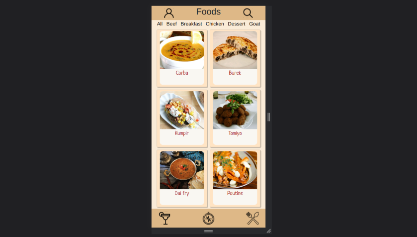
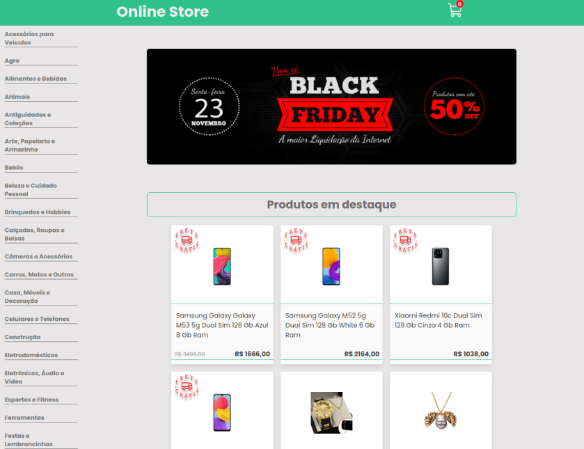
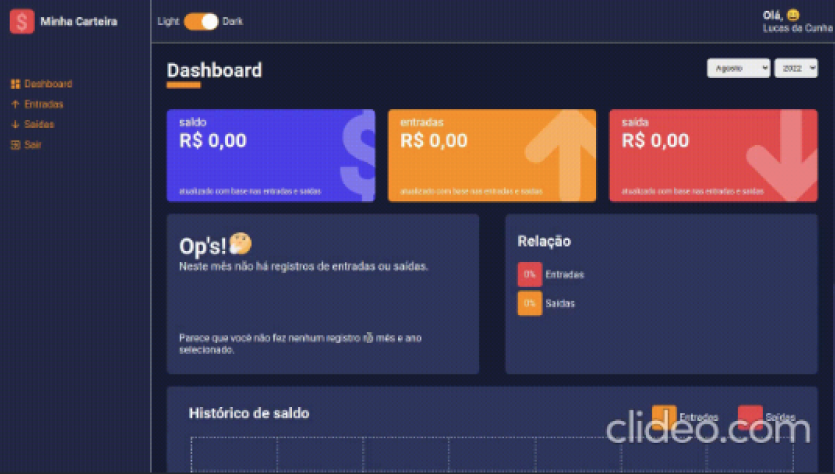
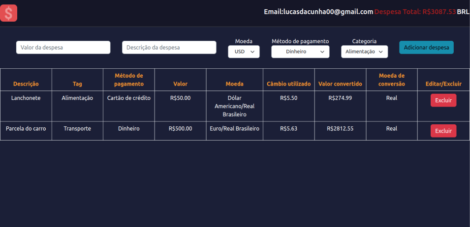

<h1 align="center">Hi 👋, I'm Lucas</h1>
<h3 align="center">A passionate fullstack developer</h3>

- 🌱 I’m currently learning **TypeScript, POO, SOLID**

- 🛫 I love the beach and exotic places!

- 📫 You can reach me at lucasdacunha00@gmail.com or add me on [LinkedIn](https://www.linkedin.com/in/lucas-da-cunha-moreti/).

- 🧑🏻 Take a look at my [portfolio](https://my-portfolio-lucasdacunhamoreti.vercel.app/)

<h3 align="left">Languages and Tools:</h3>
<h4 align="left">Frontend</h4>

  
       

<h4 align="left">Backend</h4>

  

<h3 align="left">UI Projects</h3>
<table>
  <tr>
    <td valign="top">
      <h3 align="left">App Recipes</h3>
      

        <a href="https://github.com/lucasdacunhamoreti/app-recipes">Repo</a>
      

      
React, ContextAPI

      
    </td>
    <td valign="top">
      <h3 align="left">Frontend Online Store</h3>
      

        <a href="https://frontend-online-store-lucasdacunhamoreti.vercel.app/">Demo</a>,
        <a href="https://github.com/lucasdacunhamoreti/frontend-online-store">Repo</a>
      

      
React, StyledComponents

      
    </td>
    <td valign="top">
      <h3 align="left">My Wallet</h3>
      

        <a href="https://my-wallet-lucasdacunhamoreti.vercel.app/">Demo</a>,
        <a href="https://github.com/lucasdacunhamoreti/my-wallet">Repo</a>
      

      
React, Typescript, Recharts

      
    </td>
    <td valign="top">
      <h3 align="left">Trybe Wallet</h3>
      

        <a href="https://trybe-wallet-lucasdacunhamoreti.vercel.app/">Demo</a>,
        <a href="https://github.com/lucasdacunhamoreti/trybe-wallet">Repo</a>
      

      
React, Redux, Javascript

      
    </td>
  </tr>
</table>
